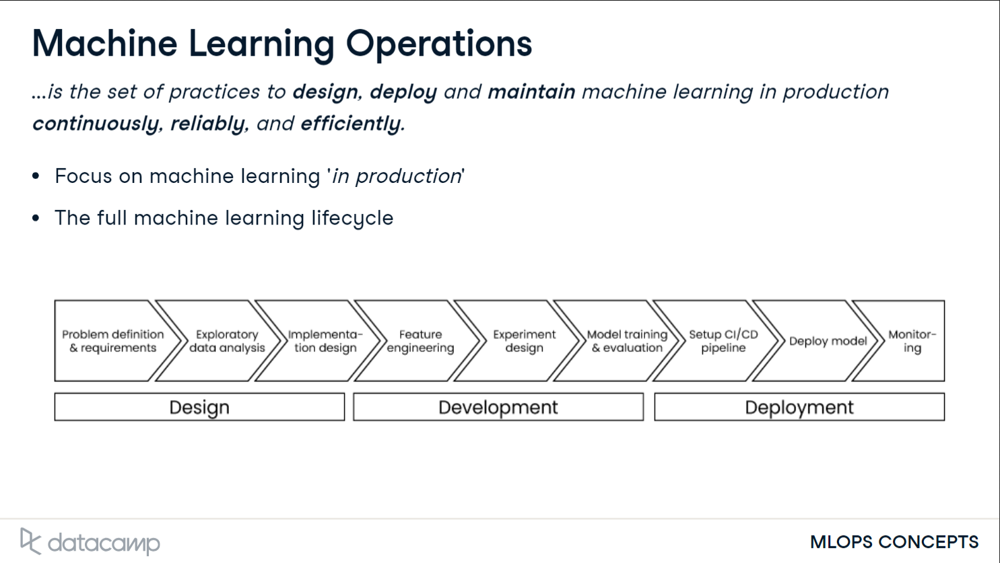
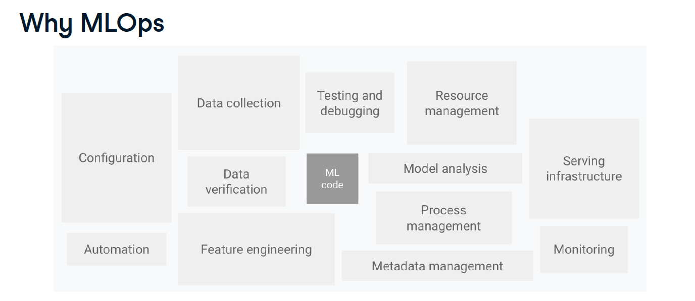

# MLOps Concepts

## Introduction to MLOps

### What is MLOps?

### Why MLOps?

- In a real-world machine learning system, numerous components come into play beyond just the machine learning code. High-quality data is essential before we can train a model, and feature engineering is necessary to create useful inputs for training. After training, we need to thoroughly analyze the model's performance. Once the model is deployed in production, continuous monitoring is crucial to ensure it stays accurate and reliable over time. Key practices like MLOps are vital to ensure all these components integrate seamlessly and function effectively together.

- Through MLOps principles we can automate the deployment of models, which reduces manual errors and speeds up the process of getting models from development to production. MLOps also facilitates monitoring of model performance, which helps to maintain accuracy and reliability over time.

### What is the origin of MLOps?

- **MLOps** originates from **Development Operations**, also called DevOps.
- **DevOps** describes a set of practices and tools that can be applied to software development to ensure that software is developed continuously, reliably, and efficiently.
- Traditional software development used to be slow because of the separation of Development and Operations teams. The development team consists of the people who write the code, who were separated from the operations team, the people who deploy and support the code.
- This is why **DevOps** is an integration of both teams. Similar to how DevOps is applied to software development, MLOps is applied to machine learning development.

### What is the Benefits of MLOps?

- Improve the overall speed of developing and delivering machine learning models.
- Processes also become more reliable and secure because of MLOps.
- It aims to bridge the gap between machine learning and operations teams, which enhances collaboration.

### What is the MLOps life cycle?

- The machine learning lifecycle is important because it gives a high-level overview of how a machine learning project should be structured in order to deliver real, practical value. It also defines the roles that are required at each step to make the project into a success.

- In the **design** phase, we focus on the **design** of the machine learning project.
- We define the context of the problem and determine the added value of using machine learning.
- We also gather **business requirements**, as well as establish **key metrics** through which we can track the progress of the machine learning lifecycle.
- Additionally, we need to gather data and make sure the data quality is sufficient for developing a machine learning model.

- In the **development phase**, we focus on developing the machine learning model.
- We do this by experimenting with a combination of data, algorithms, and hyperparameters in line with the implementation design.
- During the experiment, we train and evaluate one or more models in order to find the most suitable one.
- The goal of the development phase is to end up with the most suitable machine learning model that is ready for deployment.

- In the **deployment** phase, we **integrate** the machine learning model we developed earlier into the business process.
- This might involve building a **microservice** from the machine learning model.
- A **microservice** is a small application that includes the machine learning model such that we can easily integrate it into the business process.
- We also aim to set up **monitoring** of the machine learning model. We can set up alerts when we encounter **data drift** or when our model does not output a prediction anymore. This ongoing monitoring ensures that our model remains effective and continues to deliver value over time.
- **Data drift** occurs when our data changes, which impacts the machine learning model.

- There are different roles that are involved within the machine learning lifecycle.
- There are two categories of roles: **Business roles** and **technical roles**.

- The **business stakeholder** is sometimes also referred to as the **product owner**.
- They are a managerial staff making budget decisions, and they make sure the machine learning project is aligned with the high-level vision of the company.
- They are involved throughout the lifecycle. First, they define the business requirements during the design phase. In the development phase, they also see whether the initial results from the experiments are satisfactory. Later in the deployment phase, they again examine whether the outcome of the lifecycle is as expected.

- The **business subject matter expert**, who has domain knowledge about the problem that we are trying to solve.
- In retail, this could, for instance, be someone from the sales team that knows the variables that influence sales.
- The **subject matter expert** is involved throughout the lifecycle because they can assist the more technical roles with interpreting the data and results at each step.

- The **data engineer** is responsible for the collecting, storing, and processing of data.
- This also means that the **data engineer** should check the **data quality** and include tests such that the quality is maintained throughout the process.
- Therefore, the **data engineer** is mostly involved with tasks that have to do with data before training the model, during the model training, and once the model is used in production.

- The **data scientist** is responsible for **data analysis** and **model training** and **evaluation**.
- The **evaluation** includes monitoring the model once it has been deployed to ensure that the model predictions are valid. We can find the data scientist in all phases of the lifecycle, but mostly during the **development** phase.

- The **software engineer** is mainly involved in the **deployment** phase, where they write software to **run** the **model**, **deploy** the **model**, and **monitor** whether the **model** is and stays online once it is deployed.
- They also make sure that code is written in accordance with **common** guidelines. Since the deployment is an important part of the machine learning lifecycle, the software engineer should also be included in the design phase.

- The **machine learning engineer** is a relatively new role that is quite versatile and designed specifically to have expertise over the entire machine learning lifecycle.
- It is a cross-functional role that overlaps with the other technical roles. As such, the **machine learning engineer** is involved in all phases.
- They know, for instance, how to extract and store data and develop or deploy a machine learning model.

- The **backend engineer** is someone that is mostly involved with setting up the **cloud** infrastructure to enable development and deployment of machine learning models.
- This could be a database for storing the data, but also the computers that run the machine learning model.

## Design and Development

### Added Value

- The **machine learning design lifecycle** starts with determining the **added value** of building and running the machine learning model.
- This is often expressed in terms of money or time. It is wise to estimate the potential a certain project has.

### Business Requirements

- Identifying **business requirements** is crucial for machine learning lifecycle design phase.
- It is critical to think about the **end user** of the machine learning model.
- You must consider the **frequency** of the predictions and how **fast** we need them.
- We must also **evaluate** the **model's accuracy** and whether its results are **explainable** to non-experts.
- **Transparency** enables us to find why the model makes its predictions, why it is wrong, and how we can improve the model. These requirements all have an impact on what algorithm we will use.
- A machine learning model's **predictions** should be **explainable** since it is difficult to improve a model if we don't know why it makes its **predictions.**
- Depending on the problem we are trying to solve, there could also be **compliance** and **regulatory requirements** to the usage of machine learning.

### Key Metrics

- In order for **machine learning lifecycle** to progress as expected, it is wise to track the performance of the model.
- We’ve seen that roles involved in **MLOps** processes are **multidisciplinary** and thus also have their own way of tracking performance.
- The **data scientist** looks at the accuracy of a model, how many times the algorithm is correct.
- The **subject matter expert** is interested in the model's impact on the business, for instance, how their work improves due to the use of machine learning. They are primarily interested in **domain-specific metrics**.
- The **business stakeholder** is more interested in the monetary value of the model, in how many cases do we actually generate revenue. This is often expressed in money or time.
- To get the most out of machine learning, we must align the different metrics to make sure everyone is on the same page.

### Data Quality and Ingestion

- **Gathering data** is part of the design **phase**. During this phase, we investigate the **data quality** and how we **extract** the required data.
- What is **Data** **Quality**?
- The **quality** of a **machine learning model** is highly **dependent** on the **quality** of the **data**.
- **Data** sits at the core of the **machine learning model**. Therefore, having a clear view of the **data quality** is crucial for the success of the **machine learning lifecycle**.
- Having **poor data quality** is detrimental for the performance of the machine learning model. Improving the data quality is often the first step to improving the model's performance.

- **Data quality** can be defined along four main **dimensions**, namely **accuracy**, **completeness**, **consistency**, and **timeliness**.
- **Accuracy** describes the extent to which data is accurate or correct for the task at hand.
- **Completeness** is about to what extent the data fully describes the problem at hand.
- **Timeliness** is about in what time frame the data will be readily available.

- Having a lower **data quality** in one or more dimensions does not mean that the project is bound to fail. There are multiple things we can do to tackle **low data quality**, such as collecting more data or filling missing data with other sources.
- In the design phase, we also look into how to **extract** and **process** data. This is done by using an **automated data pipeline.**
- A **data pipeline** is often a part within the **machine learning lifecycle** through which data is automatically processed.
- A common type of **data ingestion** process is **ETL**, which stands for **extract**, **transform**, and **load**.
- It describes the three steps gone through in an **ETL pipeline**. The data is **extracted** from the source, **transformed** to the required format, and **loaded** into some internal or proprietary database.
- In an **ETL pipeline**, we can also include **automated checks**, such as expectations we have about certain data columns.
- Including these **automated checks** in a data pipeline helps **speed** up the **development** and **deployment** phase of the lifecycle, since faulty or low-quality data will affect the machine learning model.

### Feature Engineering and The Feature Store

- After the design phase,  ****is the next step in the machine learning development process.

- There is often much more data available in actual machine learning projects, and thus a lot of possibilities to engineer features. Therefore, **feature engineering** is an extensive part of machine learning development.

- An important weigh-off in **feature engineering** is when to keep engineering or when to stop engineering.
- Doing comprehensive **feature engineering** may produce a very accurate model or achieve more stability.
- However, doing comprehensive **feature engineering** also comes at a cost, which can impact the success of our machine learning project. More features can be more expensive, since this might require costly pre-processing steps. More features also require more maintenance. And lastly, more features can also lead to noise or over-engineering.

- As the number of projects and thus the number of machine learning models grows, storing features in a structured and centralized way can greatly accelerate the development of machine learning models.
- In order to do this, an important tool in MLOps is the **feature store**. A **feature store**, as the name says, is a tool for storing commonly used features or variables relevant to the machine learning model.
- The **feature store** is the central place where features can be managed. Using a **feature store**, a data scientist can find the appropriate features for their project, define new features, and use the features for training the model.
- It's also the place where features can be monitored. Simultaneously, by using a **feature store**, we ensure that features are ready to be used as input for the machine learning model in production when new samples come in.

- In some cases, it might be redundant to use a **feature store**. Factors to consider when you are deciding to use a feature store are the computational cost of features. Sometimes the features will be ready as input for the machine learning model as-is. Whether to use a feature store also depends on the amount of projects we have. The answers to these questions will determine whether the current machine learning development benefits from a **feature store** or not.

### Experiment Tracking

- Part of machine learning model development is performing machine learning experiments.
- In a machine learning experiment, we train and evaluate multiple machine learning models to find the best one.

## **Deploying Machine Learning into Production**

### Preparing Model for Deployment

- Once the machine learning model is developed, we need to move the machine learning model into the production environment.
- In the production environment, the machine learning model will make predictions based on actual, incoming data. Once deployed, the model is live and will create actual business impact.
- Deploying a model to the production environment is not that simple because they are set in different runtime environments.
- A runtime environment is the environment in which the model is running. During the development, the model runs in the development runtime environment.

- In a development runtime environment, we may use different versions of Python and certain libraries. This causes problems because the same code may not work in the different runtime environments or may produce differing results.

- To mitigate having different environments, we can use separate but identically set up machines. This is similar to a regular computer. It has the physical hardware, operating system, libraries, and the application. The libraries and application contain the production environment and machine learning model. This is a straightforward solution, but hard to maintain and not scalable. With each update, we have to update the whole machine.
- We can also use one or more virtual machines on one separate machine. Each virtual machine is like a virtual version of the regular physical computer with an operating system, libraries, and the application. A computer that is running virtual machines has a hypervisor. This helps distribute the resources, the hardware of the computer, over different virtual machines. This is easier to maintain but does require a lot of resources, because we need a virtual computer for each application.
- Lastly, we could use something called a container. This allows us to run multiple applications on one machine. Containers use less resources than a virtual machine and are more portable than the applications on a virtual machine. It can be seen as a more lightweight version of the virtual machine. Deploying the machine learning model as a container is currently the standard for MLOps.

- Using containers provides numerous benefits. Firstly, they are easier to maintain. Secondly, containers are very portable, since we only have to build them once, and then we can run them anywhere. Lastly, containers are fast to start up, since it just contains the required application and not a hypervisor or virtualized operating system, like we would need in a separate or virtual machine.
- However, these benefits do not mean that each application should be deployed as a container. If the application has worked well on a virtual machine and does not suffer from problems of different environments, it's fine to not use containers.

### Machine Learning Deployment Architecture

- After taken care of the different runtime environments, we need to think about how to deploy the machine learning model. This also implies that we need to think about how we set up the architecture.

- In a monolithic architecture we can run each service on the same computer, also known as a single instance. The application is one uniform application that includes all services.
- In traditional software development, applications were often built in a monolithic architecture.

- A different solution is the microservices architecture. The microservices architecture is, contrary to the monolithic architecture, a collection of smaller services that can be deployed independently.

- If an application fails in a microservices architecture, only the separate service fails, while in a monolithic architecture, the whole application will fail.
- A monolithic application can become complex since all services are intertwined and not independent. This also makes it harder to scale.
- The usage of a microservices architecture depends on the application. If our application is very small, having a separate microservice for each even smaller part can become costly because each service requires compute power and has to be maintained independently.

- It is common practice to deploy the machine learning model as a microservice. This allows us to use the machine learning model to make predictions based on new, unseen data.
- This process is also called inferencing. It is the process in which we send new input, for instance, the input data of a customer, for which the machine learning model will infer an output.

- To provide communication between microservices, an application programming interface (or API) is used.
- An API is a set of pre-defined input and output combinations that allows different services to communicate.

- After the model has been deployed as a microservice and the API allows us to inference the model, one last step is required. The last step is to integrate the model within the business process.
- This is different for each business, but most of the time involves connecting the API with the system that is already in place.
- Before we actually use the machine learning model in production, it is common practice to first test the model with a sample of the data to make sure everything works as expected.

### **CI/CD and Deployment Strategy**

- The CI/CD pipeline is also part of the deployment phase.

- The use of continuous integration and continuous deployment (or CI/CD) is an important concept within software development. CI/CD originated from DevOps, and focuses on automating the deployment of code. It is a series of steps in developing, testing, and deploying the code.
- Using a CI/CD pipeline, software developers can easily make incremental changes and then push these changes to the production environment. These same principles can be applied to developing and deploying code for machine learning models.

- Continuous integration is the practice where code changes are continuously integrated quickly and frequently.
- Each change is automatically tested when these are committed and merged. In this way, we can identify errors and bugs easily and make sure that many developers can work together on the same code.

- Continuous deployment works together with continuous integration by automating the release of the code that was validated during the continuous integration process. The goal of the practice of continuous deployment is to always have production-ready code.

- Setting up a CI/CD pipeline can be tedious at the start, but it can greatly speed up the deployment process.
- To summarize, continuous integration is a set of practices while the code for running the machine learning model is being written. Continuous deployment is a set of practices after the code is completed.

- Once a machine learning model is ready to be deployed, we can choose different deployment strategies. Each strategy has a different way of replacing the old machine learning model with the new machine learning model. We will look into three deployment strategies, namely, basic, shadow, and canary deployment.

- In a basic deployment strategy, we simply replace the old model with the new model in production. All new input data will be sent to the new model instead of the old model.
- In the shadow deployment, we send new data both to the new model, as well as to the old model. We still use the old model in production. The result of both models will be tested in order to make sure the new model works as expected.
- Using canary deployment, we use the new model in production, but only for a small part of new incoming data. In this way, we do use the new model right away, but in case the new model fails, only a small number of users is affected.

### **Automation and Scaling**

- The machine learning lifecycle is an experimental process, which means we frequently have to go back and forth through the different phases. Therefore, automation can greatly help to speed up the lifecycle. For example, it enables us to easily repeat the same experiments multiple times.
- Since machine learning often works with large amounts of data, it is also required to set up a scalable system. Therefore, automation and scaling are crucial concepts in MLOps.

- The design phase is the most important phase within the machine learning lifecycle. Without a decent objective and high-quality data, the other two phases might fail.
- Since machine learning is multidisciplinary, as we've seen by the different roles involved, it is important to have everyone aligned.
- In terms of automation and scaling, the design phase remains a manual process. However, the design can be templated to get the added value, business requirements, and key metrics. This turns the design phase into a structured process in line with MLOps practices.
- Data acquisition and data quality checks can be automated. Since the quality of the machine learning model is reliant on the quality of the data, automating the data acquisition process improves the chances of successfully using machine learning in production.

- In the development phase, we use a feature store to track and develop features. A feature store saves time that would have been spent building the same features used in previous experiments.
- We use experiment tracking to automate tracking the machine learning development. This also helps in evaluating the models and aligning them with the key metrics set in the design phase. The experiment tracking also makes sure that the development process is reproducible. We can find which configurations were used and what the results were.

- In the deployment phase, we can make use of containerization to mitigate different runtime environments. In terms of scaling, having applications in containers makes it easy to start up multiple versions of the same application when more requests come in. For instance, when the company grows and we need to predict customer churn for a lot of customers at the same time.
- A CI/CD pipeline is used to enable fast incremental changes during development by using automation. This allows multiple developers to work on the same code and helps in automating the development and deployment process.
- A microservices architecture can greatly help in scaling machine learning. Each new service can be developed and integrated independently without affecting other services.

## **Maintaining Machine Learning in Production**

### **Monitoring machine learning models**

- The monitoring and retraining of machine learning models is the last part of the deployment phase. We will first look into monitoring.

- When a machine learning model is deployed in production, we are not done yet. In production, the machine learning model will start making predictions based on new, unseen input. To make sure that the model is working as expected, we need to monitor the model.
- We can monitor the model by looking into the input data, and the model output, its predictions. This is called statistical monitoring. For instance, we could monitor the predicted probability that a customer will churn

- We can also look into more technical metrics of the model. This is called computational monitoring. This could be the number of incoming requests that are made, the network usage of the model, or the number of resources a server uses to keep the model running.

- Over time, we will find out whether that customer has actually churned. The actual result is also known as the ground truth. Using the ground truth, we can find out whether the model is performing as expected or if the model quality deteriorated over time.
- This loop in which we compare the output of the model to the ground truth is called the feedback loop.
- The feedback loop is a crucial part of improving the machine learning model. Using the feedback loop, we can find out when and why the model was wrong. We could, for instance, see that the model makes a wrong prediction for particular customer groups.

- It is wise to monitor both statistical and computational metrics. This will help to see where the machine learning model might be having problems and enables us to mitigate those problems

### Retraining a Machine Learning Model

- Inherent to data is that it changes over time. It is a given that the world is changing, and since our machine learning model depends on data, these changes also impact the model. This is also why a model might need retraining.
- Retraining means that we use new data to develop a fresh version of the machine learning model, such that it learns and adjusts to new patterns.

- Data drift describes a change in the input data. Over time, we could get customers of different ages or customers from different regions.
- Changes in the input data might affect the performance of the machine learning model, but since data inherently changes, this is not necessarily the case.

- Another type of drift is concept drift. Concept drift describes a change in the relationship between the input data and the target variable.
- This could be the case when our customer's behaviour changes. This would, for instance, happen when the same input data causes a customer to not churn instead of churn. In that case, the relationship between the input and output data has changed.
- Concept drift could cause our model performance to deteriorate because the patterns that the model was previously trained on do not hold anymore.

- How often to retrain depends on several factors. The first one is the business environment. One business environment can be more subject to changes than others. This can also be identified by a subject matter expert that has more knowledge about the environment, for instance, when they might expect a change.
- Secondly, how often to retrain also depends on the cost of retraining. Training a model requires resources. Depending on the complexity of the model, retraining requires more resources and, thus, more money.
- Lastly, the business requirements influence how often to retrain the model. If it is required that the model to always have an accuracy of more than 90%, and a small change in data causes the accuracy to decrease below that threshold, the model will require retraining more often.
- How fast the model accuracy goes down is also called model degradation.

- When we retrain, a new model is obtained by using new data. We could either use a model that only uses new data, such that there is a separate model trained on old data and a model trained on new data.

- We could also combine new and old data to develop a new model. This will also depend on the domain, cost, and required model performance.

- Depending on the maturity of machine learning within the company, we could also apply automatic retraining once a certain amount of data or a concept drift is detected. For instance, when we detect that the average age of customers is changing.

### Levels of MLOps Maturity

- The MLOps maturity is about the automation, collaboration, and monitoring within machine learning and operations processes in a business. It does not necessarily mean that a higher level of MLOps maturity is better. However, it does show where there is potential room for improvement to further enable the usage of machine learning within the business.
- The levels mostly apply to the development and deployment phase. The design phase cannot be fully automated since it requires human input from multiple different roles, but templates can be used in order for the phase to progress more quickly and smoothly

- We can distinguish three levels. Each with its own level of automation, collaboration, and monitoring.
- In level 1, there is no automation at all, and the machine learning and operations teams work in isolation.
- In level 2, there is automation in the development of machine learning models, and machine learning and operations teams collaborate together when a new model is ready for deployment.
- In level 3, the machine learning lifecycle is fully automated throughout the development and deployment phases.

- In the lowest level of MLOps maturity, there are no automated processes. From data ingestion to model deployment, everything has to be done manually. Teams or roles working on the use case work on them in an isolated manner. Each phase is passed off onto the next, and there is little collaboration. There is little to no traceability. The features used, experiments, and performance of the model are not tracked.
- A company that just started using machine learning will start at this level. Since all processes are manual, the development and deployment will take more time and involve more work, especially when something goes wrong during one of the phases.

- In the second level of MLOps maturity, not all processes are manual anymore. There is automation in the development process of the machine learning model. This is typically done by using feature stores and automated model training. There is a continuous integration pipeline, but once developed, models are not yet automatically deployed.
- There is some collaboration between the machine learning and operations teams. However, the deployment of new models still happens manually. There is some traceability in this level, especially during the development process. It is easy to reproduce models and track model performance during development. After deployment, there is often a small amount of monitoring.

- In the highest level of MLOps maturity, the development, as well as the deployment of machine learning models, is automated. There is a full CI/CD pipeline to develop, test, and deploy new models to production. There is close collaboration between the different roles involved in the machine learning pipeline. Machine learning models in production are monitored and, in some cases, even automatically triggered to retrain.

### MLOps Tools

- Let's dive into some possible tools we can use per component discussed throughout this course.

- For the feature store, multiple tools are available, such as Feast and Hopsworks. Feast is an open-source feature store. Feast is a self-managed feature store, meaning we have to manage it ourselves, which requires more work but also provides more flexibility compared to other feature stores.
- Hopsworks is also an open-source feature store, part of the larger Hopsworks platform. It is, therefore, more likely to be used if the rest of the Hopsworks tools are already in use

- MLFlow and ClearML offer tools for the machine learning lifecycle, including experiment tracking.
- MLflow is specialized on machine learning development, while ClearML also provides tools to deploy models.
- Weights and Biases has its main focus on tracking and visualizing experiment results.

- For containerization, Docker is the most popular tool to containerize an application.
- Kubernetes is used to run the containerized application, enabling automatic deployment and scalability.
- Apart from these open-source tools, cloud providers AWS, Azure, and Google Cloud also provide their own tools for running containerized applications.

- Jenkins is an open-source CI/CD tool, while GitLab is not. Both of these tools allow developers to work on code together using a repository. For each project, there is often a separate repository, which we can see as a directory that contains all code for the project.

- We can distinguish tools that focus on monitoring of the machine learning model and tools that monitor the data.
- Both Fiddler and Great Expectations provide statistical monitoring tools.
- Fiddler focuses on the model performance, for instance, how well our model predictions are doing.
- Great Expectations focuses on data monitoring, for instance, how much data is missing in a certain column.

- There is also tooling available that provides a full machine learning lifecycle platform. Each cloud provider, AWS, Azure, and Google, has one. They are called AWS Sagemaker, Azure Machine Learning, and Google Cloud AI Platform.
- Tools that cater the full machine learning lifecycle provide tools for every task in the lifecycle. This could be a tool for doing data exploration and data processing, but also a feature store and model training tool.

